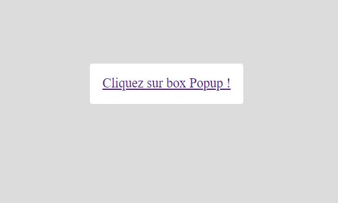
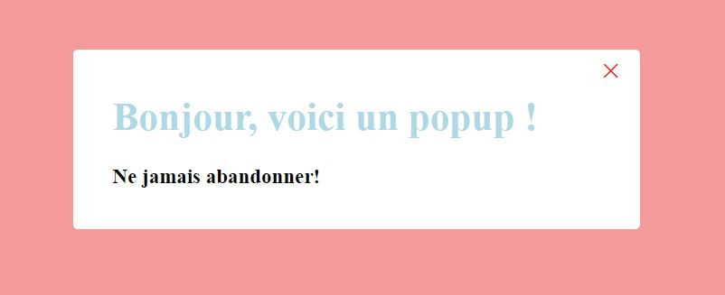

#Comment créer une popup box en utilisant HTML et CSS ?

Dans cet article, nous allons    voir comment créer une popup box   en utilisant HTML et CSS .   Une fenêtre contextuelle   (ou boîte de dialogue) est une fenêtre modale   utilisée pour informer, avertir ou recevoir une entrée de l'utilisateur.

__Pratique :__ Dans cette exercice, nous montrerons comment créer une boîte ou une fenêtre contextuelle en utilisant [HTML](https://www.w3schools.com/html/default.asp) et [CSS ](https://www.w3schools.com/Css/). Nous utilisons des balises HTML de base telles que les balises d'[en-tête](https://www.w3schools.com/html/html_head.asp) , de [paragraphe](https://www.w3schools.com/html/html_paragraphs.asp) , de bouton et d'ancre . Nous créons un bouton et une fois cliqué, la boîte contextuelle s'ouvrira comme vous pouvez le voir dans la sortie. L'élément d'ancrage est attaché à la boîte contextuelle avec la classe "modale" en utilisant l'attribut href qui est utilisé pour spécifier un lien vers l'adresse "boîte contextuelle".

__Vous allez sur le bouton comme suit:__

